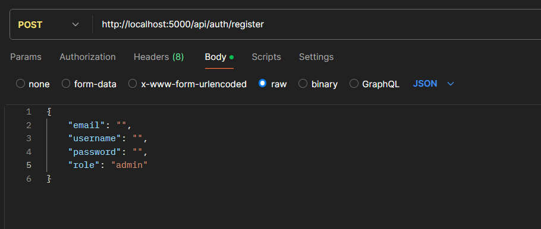
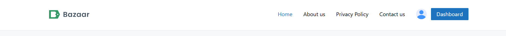
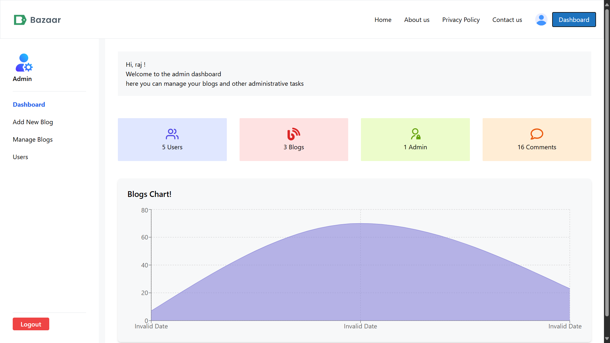

## Getting Started

These instructions will get you a copy of the project up and running on your local machine for development and testing purposes.

### Prerequisites

NPM / Yarn and Node.js installed

### .env

In the backend > create a .env file and add below details.

```
PORT = port no.
MONGODB_URL = mongoDB url
JWT_SECRET_KEY = your seceret key

```

### Installing

Installing NPM modules on both frontend and backend folders

Execute these commands from the project directory

```
cd frontend && npm install
```

```
cd backend && npm install
```

### Running the app

Open a terminal on backend directory

```
npm start
```

and open another terminal on frontend directory

```
npm run dev
```

Access the web app at http://localhost:5173/

### Admin access

first create admin using postman and login





Now you can use Dashboard

